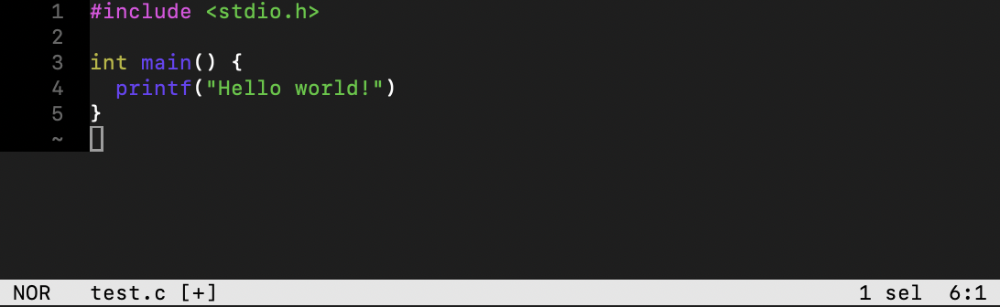

## Bad `vi`bes

I often find myself needing to edit text on an emulated Android system and it's always a pain.
Rebuilding from source takes too long. Editing the file on my computer and then `adb push`ing it over is cumbersome.

So I often reach for the [toybox](https://en.wikipedia.org/wiki/Toybox) implementation of `vi` to read and edit files, but it leaves a lot to be desired.
The thing I miss the most is syntax highlighting.
It's absence especially painful given there is no file _reader_ native to the emulator shell aside from `cat` and `more`.

And the prospect of cross compiling `vim` or `emacs` for Android seemed quite daunting - why spend a day or two in build system hell?
I'd rather just `adb push` and `adb pull` instead.

Though recently I was able to cross compile a Rust project for Android with ease using [cargo-ndk](https://github.com/bbqsrc/cargo-ndk).
It made me wonder if there was a modern text editor written in Rust that I could quickly `cargo build`, throw on my emulator, and make my text editing in the `adb shell` a lot easier.


## Cross compiling Helix for Android using `cargo ndk`

[*Helix*](https://helix-editor.com/) is terminal-based modal (vi-like) editor written in Rust.
It has lots of built in functionality including language server support, [tree-sitter](https://tree-sitter.github.io/tree-sitter/) integration, sane defaults, but most importantly, syntax highlighting.
A perfect candidate for use in our `adb shell`.

To compile helix on a modern Linux machine, first install basic compilation tools (`build-essential` package on Debian-based distros) and [install Rust](https://www.rust-lang.org/tools/install) with `rustup`.

Then install [cargo-ndk](https://github.com/bbqsrc/cargo-ndk) and the various Android Rust targets with `rustup`:

```bash
cargo install cargo-ndk
rustup target add \
    aarch64-linux-android \
    armv7-linux-androideabi \
    x86_64-linux-android \
    i686-linux-android
rustup target install \
    aarch64-linux-android \
    armv7-linux-androideabi \
    x86_64-linux-android \
    i686-linux-android
```

Download the [Android NDK](https://developer.android.com/ndk/downloads/) and set your `ANDROID_NDK_HOME` environment variable:

```bash
wget https://dl.google.com/android/repository/android-ndk-r27c-linux.zip
unzip android-ndk-r27c-linux.zip
export ANDROID_NDK_HOME=$(pwd)/android-ndk-r27c
```

Finally get the Helix source code and [build it](https://docs.helix-editor.com/master/building-from-source.html#linux-and-macos) using `cargo ndk` (for `arm64-v8a` or `x86_64`):

```bash
git clone https://github.com/helix-editor/helix
cd helix
cargo ndk -t arm64-v8a build --release
```

It's that easy.

## It's not that easy

A helix binary built for android will be at `target/aarch64-linux-android/release/hx` and the various runtime files at `runtime/`. We can push them to the emulated device:

```bash
adb push target/aarch64-linux-android/release/hx /data/local/tmp
adb push runtime /data/local/tmp
```

But when we run it we get a logging error:

```text
adb shell
emu64a:/ # /data/local/tmp/hx
Error: failed to initialize logging

Caused by:
    No such file or directory (os error 2)
```

The default log file for helix is `~/.cache/helix/helix.log` but on android the default `$HOME` is `/`, which is read only:

```text
emu64a:/ # env | grep HOME
HOME=/
emu64a:/ # mount | head -1
/dev/block/dm-0 on / type ext4 (ro,seclabel,relatime)
```

So we can set `$HOME` to the writable `/data/local/tmp` and move the `runtime/` directory to where helix expects: `~/.config/helix/runtime/`:

```text
emu64a:/ # export HOME=/data/local/tmp
emu64a:/ # cd
emu64a:/data/local/tmp # mkdir -p .config/helix
emu64a:/data/local/tmp # mv runtime/ .config/helix/
```

But we still don't get syntax highlighting -- and the log tells us why:
```text
emu64a:/data/local/tmp # ./hx test.c
emu64a:/data/local/tmp # cat .cache/helix/helix.log
2025-02-10T00:00:19.701 helix_core::syntax [ERROR] Failed to load tree-sitter parser for language "c": Error opening dynamic library "/data/local/tmp/.config/helix/runtime/grammars/c.so": dlopen failed: library "libc++_shared.so" not found: needed by /data/local/tmp/.config/helix/runtime/grammars/c.so in namespace (default)

```

Helix loads the relevant tree-sitter grammer as a dynamic library and it requires `libc++_shared.so`.
`libc++_shared.so` is part of the Android NDK and is often bundled in apps but doesn't exist natively on the Android system.

So let's find the relevant `libc++_shared.so` on the host system, `adb push` it into our emulated Android, and set `LD_PRELOAD_PATH` to point the Android linker to load the library:
```text
~/android-ndk-r27c$ find . -name libc++_shared.so
./toolchains/llvm/prebuilt/linux-x86_64/sysroot/usr/lib/i686-linux-android/libc++_shared.so
./toolchains/llvm/prebuilt/linux-x86_64/sysroot/usr/lib/riscv64-linux-android/libc++_shared.so
./toolchains/llvm/prebuilt/linux-x86_64/sysroot/usr/lib/aarch64-linux-android/libc++_shared.so
./toolchains/llvm/prebuilt/linux-x86_64/sysroot/usr/lib/arm-linux-androideabi/libc++_shared.so
./toolchains/llvm/prebuilt/linux-x86_64/sysroot/usr/lib/x86_64-linux-android/libc++_shared.so
~/android-ndk-r27c$ adb push ./toolchains/llvm/prebuilt/linux-x86_64/sysroot/usr/lib/aarch64-linux-android/libc++_shared.so /data/local/tmp
~/android-ndk-r27c$ adb shell
emu64a:/ # export HOME=/data/local/tmp
emu64a:/ # export LD_LIBRARY_PATH=/data/local/tmp
emu64a:/ # cd
```

And we can finally get helix running in all it's syntax highlighting glory:
```text
emu64a:/data/local/tmp # ./hx test.c
```


## Final config notes

The above steps are enough to get the helix editor working using the default configuration of Android Studio's emulator.
The downside being, of course, that you will need to `export HOME` and `LD_LIBRARY_PATH` every time you open a new `adb shell`.

Normally you could add these exports to your `.*shrc`, but on Android your `adb shell` runs `mksh`, whose sole rc file is in the read-only partition `/system/etc/mkshrc`.

You might want to boot your emulator as a [`writable-system` and disable verity](https://stackoverflow.com/questions/58010655/is-adb-remount-broken-on-android-api-29/64989222#64989222) in order to edit this file (and while you're add it add the `hx`'s binary location to your `PATH`).

And then you can use helix to edit any file on your filesystem :)
Happy Hacking!
