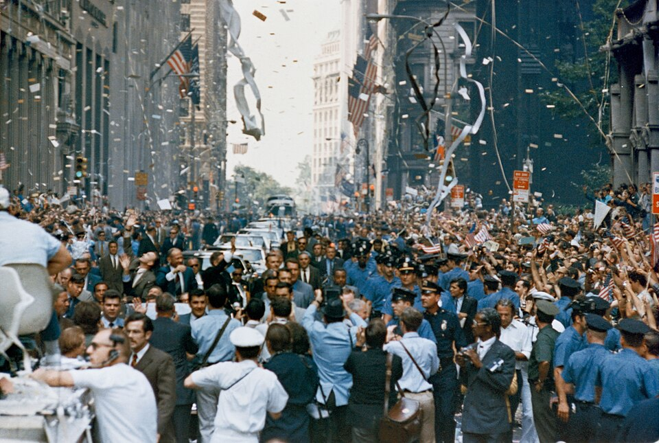

Last Saturday night the Knicks won the NBA finals for the first time in over 50 years.
The mood in the city that night was jubliant, or so I was told, as I was watching the game at a wedding out of state.
(I do believe the Knicks win blessed the wedding, or maybe vice versa)

So when Mayor Mamdani announced on Sunday there will be a [ticker-tape parade](https://en.wikipedia.org/wiki/Ticker_tape) on Thursday, I was excited about an opportunity to celebrate in the city.
And out of curiousity I looked up what makes a parade, specifically ticker-tape.

## Ticker-tape



[Ticker-tape](https://en.wikipedia.org/wiki/Ticker_tape) was an invention that revolutionized finance in late 19th century.
Stock tickers, so named for their loud sound when running, were machines that could, for the first time in history, print out realtime stock price information.
Stock tickers printed the information on little slips of paper: ticker-tape.

Busy days on Wall Street would accumulate huge volumes of ticker-tape. 
So when the parade for the dedication of the Statue of Liberty passed through the Financial District on October 28, 1886, traders threw their masses of ticker-tape out the window as makeshift streamers and the ticker-tape parade was born.

<!--  -->

Ticker-tape stopped being used in the 1960s when computerized stock information took over, though it's impact on finance lives on;
the LED stock ticker crawls are still in use in Times Square and elsewhere; 
abbreviations of company names for the tape has became the now ubiquitous stock symbol (e.g. GOOG for Google);
and the NYSE still calls different streams of trade data "tapes."



And of course, ticker-tape parades no longer use actual ticker-tape, just streamers and shredded paper.
So when I was reading this history on Monday and looking forward to the parade Thursday morning, I had a silly idea.

## The plan 

Make some real ticker-tape, as accurate as possible, and throw it out at the parade.

I had a few rough requirements for final product: 
- look as close as possible to historical ticker tape
- use real trade data from the New York Stock Exchange
- make as much of it as I could

The problem was I had almost no time to do this.
The idea came to me Monday afternoon but I had a 24 hour road trip Tuesday to Wednesday early evening.
I really only had Monday evening, Wednesday evening, and Thursday morning before the parade to work on it.

But I did have some experience printing long strips of paper.
At the [Recurse Center](https://recurse.com) last year, my friends and batchmates Alex and Julia setup a receipt printer for anyone to use.
They made a great interface so it was easy to print arbitrary text, images, or receipt printer (ESC/POS) commands.

The receipt printer was the perfect medium for this project (after all it is a machine used to print financial information on slips of paper).
It also prints very fast and in great volumes. 
Most importantly, I had access to one.
As a Recurse alumni, I could return to hub and start prototyping immediately using Alex and Julia's API. So Monday afternoon, I ran straight over.

<!-- One could argue that the real revolution in trading was from non-realtime to realtime data in the late 19th century. -->
<!-- The rise of high frequency trading in the last few decades is really a revolution in computerized trading, the  just a drift in the meaning of "realtime." -->
<!-- Thomas Edison's one character a second stock ticker to nanosecond latency with fiber optics and FPGAs. -->

## Anatomy of ticker-tape



For trades executed on the exchange, ticker-tape prints the stock symbol above and the price and volume information below, with one character per column.

Stocks traditionally trade in groups of 100 known as "lots."
If one lot was traded, just the price that lot traded at would be printed.
So reading the tape above, the stock BCX traded one lot at the price $26.75.

If multiple lots were traded, then `<number of lots> s <lot price>` would be printed.
So again, above, MGM traded two lots (200 stocks) at $28 a share.
Trades would come as they were executed, in chronological order.
Currently stock prices are rounded to the nearest cent, but historically they were rounded to the nearest eighth of a cent. For old school aesthetics, I wanted to show prices as eigthts of a cent.

So to replicate the ticker-tape, I just needed to get real market data from NYSE with trade time, symbol, price, and volume information. 

Also, ticker-tape was 3/4" wide. Receipt paper is 3 1/8" wide, or just about four times as wide as ticker-tape.
If I use the receipt printer to print stock information vertically in four columns and cut it lengthwise into quarters, it could make for pretty believable ticker tape.

## Getting NYSE Data

The New York Stock Exchange sells access to the data of all transactions it conducts at exorbitant rates, some thosands of dollars per month. 
My friend Frank pointed me to [Alpaca](https://alpaca.markets/) and their easy to use [Market Data API](https://docs.alpaca.markets/us/docs/about-market-data-api), reselling the data from the exchanges.
The free tier only gives you 200 API calls a minute, but I just needed to download *some* data only once, so even with the limit it should be more than enough.

Writing a custom trade downloader and limiting my API requests, I was able to download a full day of trading data on NYSE in under an hour for free:

```
$ python ticker_tape.py --all-nyse nyse_symbols.txt --start 2026-06-12 --raw > trades_unsorted.csv
2412 symbols in 5 batches
Batch 1/5...
  100 API calls, 286477 trades so far...
  200 API calls, 570741 trades so far...
  ...
  4800 API calls, 13285155 trades so far...
  4900 API calls, 13535261 trades so far...
Done: 13687764 trades, 4961 API calls.  
$ sort -t, -k1 trades_unsorted.csv > trades_sorted.csv
```

There were a lot more than 13 million trades on June 12, I filtered for trades with more than 100 stocks (i.e. at least one lot).
I also filtered for NYSE's tape A: stocks listed on the New York Stock Exchange.
Nasdaq-listed stocks can trade on the NYSE but I don't include them (no hate but Nasdaq was founded in 1971, after the age of ticker-tape).

I saved the data as a simple CSV of `time,symbol,lots,price`:

```
$ shuf trades_sorted.csv | head
2026-06-12T16:44:23.68829977Z,KIM,1,25.86
2026-06-12T19:29:01.095354246Z,BRO,2,60.01
2026-06-12T18:02:34.131366062Z,NRG,1,127.34
2026-06-12T19:56:53.726546135Z,STM,1,77.49
2026-06-12T15:49:21.093023174Z,SPCE,1,3.94
2026-06-12T18:58:28.337407525Z,UBER,1,68.39
2026-06-12T18:01:04.794321513Z,LOW,1,220.65
2026-06-12T18:40:08.212887027Z,EW,1,84.86
2026-06-12T16:37:59.233470346Z,GOOS,1,10.08
2026-06-12T18:26:15.475788668Z,AMPX,1,16.45
```

## Printing ticker-tape on receipt paper

Now that I have real NYSE trade data to work with, the next step is to write the data to the receipt printer.



The receipt printer understands [ESC/POS commands](https://escpos.readthedocs.io/en/latest/commands.html) which are very similar to teletype (`0x0a` is line feed, commands often start with ESC `0x1b`, etc) but with additional commands specific to receipts.
For example, `0x1b 0x6d` instructs the machine to use the built-in cutter to cut the receipt horizontally. 

The Recurse receipt printer API can take raw ESC/POS commands, so I wrote a custom tool to take in trade data input and convert it to ESC/POS for printing:

```
$ uv run python print_tape.py -o ticker_tape.escpos trades_sorted.csv
Wrote 405158 bytes to ticker_tape.escpos.1 (10000 trades, 10 cuts, 36982mm / 1456.0in)
Wrote 373732 bytes to ticker_tape.escpos.2 (10000 trades, 10 cuts, 34458mm / 1356.6in)
Wrote 359721 bytes to ticker_tape.escpos.3 (10000 trades, 10 cuts, 33321mm / 1311.9in)
Wrote 350070 bytes to ticker_tape.escpos.4 (10000 trades, 10 cuts, 32549mm / 1281.5in)
Wrote 361663 bytes to ticker_tape.escpos.5 (10000 trades, 10 cuts, 33469mm / 1317.7in)
Wrote 353659 bytes to ticker_tape.escpos.6 (10000 trades, 10 cuts, 32827mm / 1292.4in)
Wrote 351398 bytes to ticker_tape.escpos.7 (10000 trades, 10 cuts, 32664mm / 1286.0in)
Wrote 354727 bytes to ticker_tape.escpos.8 (10000 trades, 10 cuts, 32900mm / 1295.3in)
```

This script takes in each trade in the input CSV and slots it into one of four columns.
Then, after a batch of trades are placed in each column, it renders each trade in the ticker-tape style, going line by line printing a character for each column's symbol, price, or volume information.



The major ESC/POS commands I used were:
- 90° Rotation: ESC V 1 (`0x1b 0x56 0x01`)

This made everything easy to print "down" the receipt instead of "across" it. I didn't need to work with custom fonts or images, this command just rotates the text before printing it.

- Custom Glyphs: ESC & 1 and ESC % 3 (`0x1b 0x25 0x01`) and (`0x1b 0x26 0x03 ...`)

These commands were used to include custom fraction glyphs. Glyphs for ½ and ¼ are built-in characters but they didn't look exactly right. The fractions on the old ticker tape doesn't have a line seperating the two, it is just the numerator directly over the denomonator. Also, we need the ⅛, ⅜, ⅝, and ⅞ glyphs. To mimic this style exactly I had to install each of these custom glyphs. 



- Absolute Position: ESC $ L H (`0x1b 0x24 ...` )

This sets the position directly for the printed character, saving us the need to do a bunch of manual spacing. Instead, this command allowed me to just index the specific location of each character to print. 



## Cutting it up

Using Claude Code to rapidly prototype I was able to get the above receipts printed by Monday night (slop code [here](https://git.lothan.net/joe/ticker-tape) for those curious).
In some sense this was astonishing progress but in another real sense, this was the easy part.

The hard part is cutting it up.
If I want to produce ticker-tape in any volume, cutting it by hand is out of the question, it's far too slow and error prone.

I don't have much mechanical engineering experience, but I have worked with 3D printing before.
And I do shave with a safety razor.

So on Wednesday night, coming straight from the rental car drop off and with just about 12 hours before the parade, I designed and printed this little jig to guide cutting the receipt into four strips.



It's really simple, just a bottom cover to hold 3 double-edge razor blades at a slight angle. A second part, a top cover, serves to protect your hand when holding it and to keep the receipt paper pushed down onto the blades.



This was made with [OpenSCAD](https://openscad.org/), a great piece of software that lets you programmitically define 3D shapes.
Maybe not suprising at this point, but LLMs are also decent at writing working OpenSCAD code to make simple objects.

It took a bit to get the printer at the Recurse Center working and I had to babysit the print (spooling issues), but the base finished beautifully by 1am.
I set the 3D printer to print the top cover and went home, dead tired after a long day of traveling, unsure if this would work at all tomorrow.

## Moment of truth

I woke up, threw on a blue t-shirt and biked straight to the Recurse Center. 
The cutting cover finished overnight but to my horror, it didn't line up over the blades correctly.

I didn't have time to blame Claude, the 3D printer, or my own hubris.
I ripped off a piece of cardboard laying around the hub and use it as a makeshift top cover. It worked fine.



Less than two hours before the start of the parade, I printed about three receipt paper rolls and cut them up into a big pile of ticker tape.

When cutting up the receipt paper with my homemade jig I found myself much more sympathetic to printer designers.
Paper is a really difficult material to work with and even when I tried to control for feed angle, removing paper curls, and top cover pressure, pulling the receipt paper through the jig would jam up *all the dang time*.



But it was still surprisingly fast, in under an hour I had two garbage bags full of surprisingly historically accurate ticker-tape. Time to head to the parade.

## Parade

From the Recurse Center, I hopped an R-train heading into Manhattan to meet up with some friends at City Hall.
But the R was bypassing City Hall so I got off early at Courtlandt street and I stumbled out into a mob scene alone with my two bags of ticker-tape.



<!-- This was my first ticker-tape parade in New York (I moved here a few years ago), but still, I'd like to think I was somewhat prepared for what was coming. -->
<!-- I knew it was going to be a mob scene, I wasn't going to get close to the actual parade and it was going to be overall pretty unpleasant. -->

<!-- How wrong I was. -->

Cortlandt street train station connects to the Oculus, the big white transportation hub in the World Trade Center. 
At 9:30am, half an hour before the parade started, the crowd just north-east and south-east of the Oculus was so large and at a standstill, at first I thought the parade was coming down Church Street.

When I realized the parade is actually going up Broadway, a block away, I realized the extent of my mistake.
The roads heading to Broadway were shoulder-to-shoulder packed with people trying to get the smallest of views.
Visions of throwing my tape onto the parade were quickly shattered.



I wandered around for a bit in a daze, unsure what what to do next.
Then from the throngs of people I hear: "oh that's ticker-tape!"

I turn and see woman standing quite gracefully on a bollard.
Despire her stature, there was still no sightline of Broadway and she was just scanning the crowd.

"Oh yes it is! You want some?"




Ripping off a fistful of tape to hand to her and almost immediately more people started asking for some. 
Soon after realizing it was not possible to throw ticker-tape on the parade, I found a new reason to be there: giving a little throw-away souvenir to those too far away to see the actual parade.



I wandered the blocks around the Oculus, getting as close as I can to Broadway, stepping back when the crowds were too overwhelming.
It didn't take long, not more than an hour, to give away the two bags of ticker-tape to anyone who recognized it, asked, or saw someone else with a handful.




I met all kinds around the Oculus: budding Knicks fans just learning to say please and thank you, New Yorkers who remember the last Knicks win in 1973, counterfiet t-shirt salesmen, finance bros trying to get to work, those looking for a respite from the crowds, and more.

This idea seeemed like a long shot from the beginning, but the fact that a silly little project with a short time frame came together and let me connect with fellow New Yorkers made me very happy.

Love you New York <3

And let's go Knicks!


