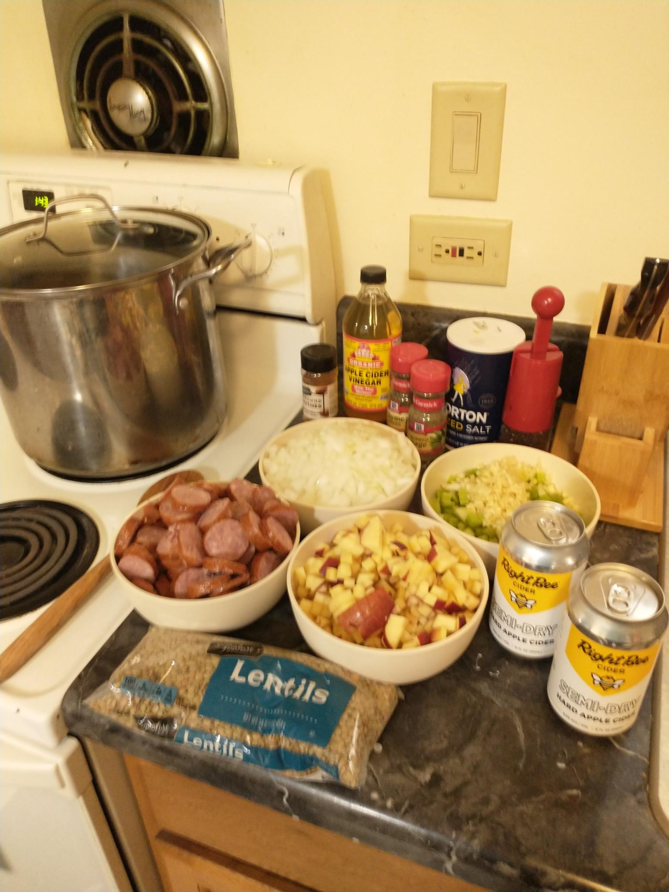
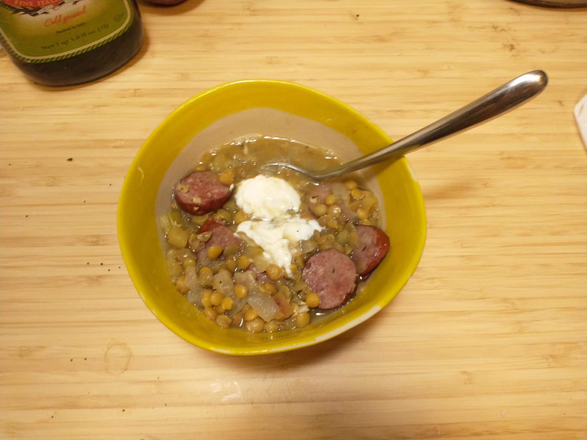
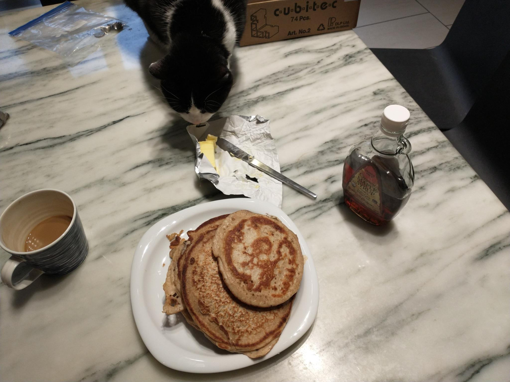

## Challenge Description

Santa and Grinch forces have declared a fragily truce. It is your job to keep the truce going by keeping Christmas cheer high. Read more on how to do this by following the provided link. [(that link)](https://github.com/AdventCTF/advent2021-christmas-truce)

## Overview

For this challenge, you had to make pancakes and soup, donate to a charity, and/or wear christmas clothes to get a flag. No, really.

Hardest flag to find? A good looking christmas sweater. So I just did the other two. 

## Writeup

For charity, I donated to [Math Circles of Chicago](https://mathcirclesofchicago.org/), a great after school math program that teaches deep math in a fun, unique way. In a way, tt works somewhat similar to non-competitive CTFs like ATOW. They both construct a fun learning environment with interesting problems that allow for exploration of some pretty advanced topics. Not just in Chicago, there are math circles all over the world, if you like Computers or Math, you should check them out! 

For the soup, I made a [lentil, apple, and sausage stew](https://cooking.nytimes.com/recipes/1021681-lentil-soup-with-smoked-sausage-and-apples). I doubled the recipe to save a bunch for later and I'm happy I did. Adding in mustard and sour cream at the end is key. Instead of Dijon I used a spicy mustard and it gave it a nice kick. A great fall/winter stew, would recommend.

For the pancakes, I made traditional American breakfast pancakes, loaded up with butter and maple syrup. Looks like I wasn't the only one who wanted a bite!

This guy looks like a radare2 dev!