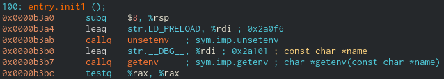
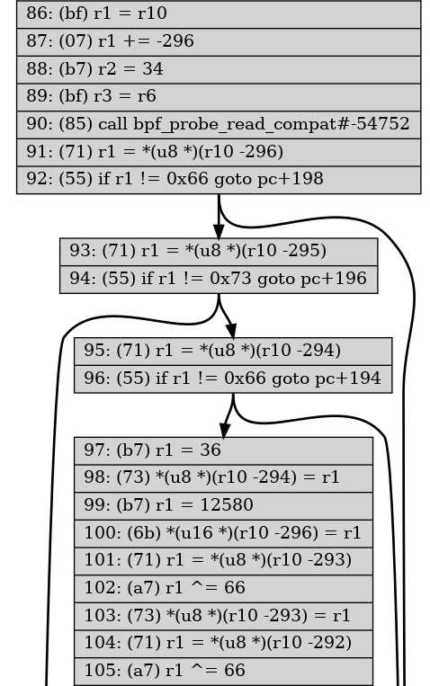

#### Challenge Description:

> After moving laterally, PROTECTIVE PENGUIN compromised a number of additional systems and gained persistence. We have identified another host in the DMZ that we believe was backdoored by the adversary and is used to regain access.

> Please download a virtual machine image of that host and identify the backdoor. Validate your findings in our test environment on egghunt.challenges.adversary.zone.

#### Write-Up:

This was hands-down my favorite challenge. I knew nothing about BPF before starting and I learned a lot. For this challenge, we have to find a backdoor on a linux host and reverse engineer it. 

We're given a `.qcow2` QEMU virtual machine image with a shell script `run.sh` that runs the image. `run.sh` forwards the TCP port 4422 for ssh access and the UDP port 1337, presumably for the backdoor. But when we login and look for listening ports on the machine, strangely, UDP port 1337 is not listed:

```
root@egghunt:~# netstat -tulnp
Active Internet connections (only servers)
Proto Recv-Q Send-Q Local Address           Foreign Address         State       PID/Program name    
tcp        0      0 0.0.0.0:4422            0.0.0.0:*               LISTEN      379/sshd: /usr/sbin 
tcp        0      0 127.0.0.53:53           0.0.0.0:*               LISTEN      365/systemd-resolve 
tcp6       0      0 :::4422                 :::*                    LISTEN      379/sshd: /usr/sbin 
udp        0      0 127.0.0.53:53           0.0.0.0:*                           365/systemd-resolve 
udp        0      0 0.0.0.0:68              0.0.0.0:*                           587/dhclient
```

I looked around a bit with `ls -la` to see if there was anything suspicious or out of place. Almost immediately I came across a very suspsicious file in `/dev/shm`. `shm` stands for shared memory - all files in `/dev/shm` are stored in memory and thus erased across reboots so it is usually empty:

```
root@egghunt:~# ls /dev/shm/
x86_64-linux-gnu
root@egghunt:~# ls /dev/shm/x86_64-linux-gnu/
libc.so.7
```

Very suspicious, a libc shared object file not in `/lib`. I wonder what program is using this (probably) malicious `libc.so.7`? We can use `ldd` to search for binaries that are linked to this file:

```
root@egghunt:~# ldd /bin/* /usr/bin/* /sbin/* /usr/sbin/* 2>/dev/null | grep "libc.so.7"
root@egghunt:~# 
```

But I guess it makes sense there are none - `/dev/shm` is ephemeral and recompiling/relinking a binary pointing to a temporary location wouldn't make much sense. It makes more sense to use an environment variable like `LD_LIBRARY_PATH` upon running a binary to inject a shared object. So let's check `/proc` to see which running processes might specify this malicious `libc` in an environment variable.

```
root@egghunt:~# grep "libc.so.7" /proc/*/environ 
Binary file /proc/974/environ matches
root@egghunt:~# cat /proc/974/comm 
cron
root@egghunt:~# cat /proc/974/environ 
LD_PRELOAD=/dev/shm/x86_64-linux-gnu/libc.so.7SHELL=/bin/bashPWD=/root...
```

So it looks like `cron` has a malicious libc injected using `LD_PRELOAD`. Taking a look at this `libc.so.7` and we find something very interesting right at the beginning of one of the `entry.init` functions:



As soon as its loaded, our malicious `libc.so.7` unsets the environment variables `LD_PRELOAD` and searches for the environment variable `__DBG__`. I bet DBG stands for debug - lets rerun `cron` but with `__DBG__` set and see what happens.

```
root@egghunt:~# kill 974
root@egghunt:~# LD_PRELOAD=/dev/shm/x86_64-linux-gnu/libc.so.7 __DBG__= cron
libbpf: loading object 'implant_bpf' from buffer
libbpf: elf: section(2) tracepoint/net/netif_receive_skb, size 2344, link 0, flags 6, type=1
libbpf: sec 'tracepoint/net/netif_receive_skb': found program 'kprobe_netif_receive_skb' at insn offset 0 (0 bytes), code size 293 insns (2344 bytes)
libbpf: elf: section(3) uprobe/getspnam_r_entry, size 336, link 0, flags 6, type=1
libbpf: sec 'uprobe/getspnam_r_entry': found program 'getspnam_r_entry' at insn offset 0 (0 bytes), code size 42 insns (336 bytes)
libbpf: elf: section(4) uprobe/getspnam_r_exit, size 312, link 0, flags 6, type=1
libbpf: sec 'uprobe/getspnam_r_exit': found program 'getspnam_r_exit' at insn offset 0 (0 bytes), code size 39 insns (312 bytes)
libbpf: elf: section(5) license, size 4, link 0, flags 3, type=1
libbpf: license of implant_bpf is GPL
...
```

Looks like out backdoor implant is liscensed under the GPL


Reading the debug output, it looks like our implant uses Berkley Packet Filter (BPF). [Wikipedia](https://en.wikipedia.org/wiki/Berkeley_Packet_Filter) defines it rather blandly as a tool to analyze network traffic, but coming from [Brendan Gregg](http://www.brendangregg.com/blog/2019-12-02/bpf-a-new-type-of-software.html), who  wrote the book on BPF,

> BPF programs ... are not processes or kernel modules, and don't appear in traditional observability tools. They are a new type of software, and make a fundamental change to a 50-year old kernel model by introducing a new interface for applications to make kernel requests, alongside syscalls.

> BPF originally stood for Berkeley Packet Filter, but has been extended in Linux to become a generic kernel execution engine, capable of running a new type of user-defined and kernel-mode applications.

So it makes sense that we wouldn't find any program listening on port 1337 - our backdoor is a BPF program which doesn't show up on "traditional observability tools". We have to learn how to speak BPF.

The most useful tool to interact with BPF programs is, appropriately, `bpftool`. Listing installed BPF programs:

```
root@egghunt:~# bpftool prog list
3: cgroup_skb  tag 6deef7357e7b4530  gpl

...

16: tracepoint  name kprobe_netif_re  tag e0d014d973f44213  gpl
	loaded_at 2021-01-14T12:15:17+0000  uid 0
	xlated 2344B  jited 1544B  memlock 4096B  map_ids 4
	btf_id 5
17: kprobe  name getspnam_r_entr  tag acab388c8f8ef0f9  gpl
	loaded_at 2021-01-14T12:15:17+0000  uid 0
	xlated 336B  jited 223B  memlock 4096B  map_ids 3
	btf_id 5
18: kprobe  name getspnam_r_exit  tag ceeabb4ac5b9ed45  gpl
	loaded_at 2021-01-14T12:15:17+0000  uid 0
	xlated 328B  jited 209B  memlock 4096B  map_ids 3,4
	btf_id 5
```

The malicious `libc.so.7` installs three BPF programs: `kprobe_netif_receive_skb`, `getspnam_r_entry`, `getspnam_r_exit`. Judging by the names of these programs, one runs at [netif_receive_skb](https://www.kernel.org/doc/html/latest/networking/kapi.html?highlight=netif#c.netif_receive_skb), the "main receieve data processing function" for linux networking. The other two run at the beginning and end of each call to [getspnam_r](https://man7.org/linux/man-pages/man3/getspent.3.html), a function to check the `/etc/shadow` file for linux password hashes.

BPF programs share data using maps. Above, we can see our `kprobe_netif_re` BPF program uses map id 4, `getspnam_r_entr` uses map id 3, and `getspnam_r_exit` uses map id 3 and 4. We can inspect these maps using `bpftool`: 

```
root@egghunt:~# bpftool map list 
3: hash  name args  flags 0x0
	key 8B  value 8B  max_entries 10  memlock 4096B
	btf_id 5
4: array  name implant_.bss  flags 0x400
	key 4B  value 36B  max_entries 1  memlock 8192B
	btf_id 5
root@egghunt:~# bpftool map dump id 3 
[]
root@egghunt:~# bpftool map dump id 4 
[{
        "value": {
            ".bss": [{
                    "backdoor": {
                        "enabled": false,
                        "hash": ""
                    }
                }
            ]
        }
    }
]
```

So presumably the `netif_receive_skb` program checks for a specific network packet that may contain a password hash and stores it in the "backdoor" map. And the `getspnam` program interupts normal logins and uses this password hash instead.

Lets take a look at the `kprobe_netif_re` to see what packet we need to send to enable the backdoor. We can dump the BPF program using `bpftool prog dump` and even better, it has support for outputing a dot file graph to get a visual of the programs flow control. [Here](images/penguin-egg-dot.png) is the full program's graph. The instruction set is a bit strange but [this documentation](https://docs.cilium.io/en/latest/bpf/) was a great help. 

`netif_receive_skb` is passed the raw packet data as an sk_buff, the common data structure for all linux networking. I spent way too long trying to understand the first few dozen instructions and the structure of sk_buffs but got almost nowhere. The breakthrough came by cheating a bit, and looking for where the program filters for UDP packets on port 1337:


Do you see it? (74) checks if two bytes are `0x3905`, which converted to little-endian is 1337. So the above code [reads](https://github.com/iovisor/bpf-docs/blob/master/bpf_helpers.rst) the UDP header and checks if the destination port is 1337 and length is 42. So minus the header, our packet should be 34 bytes long.



Next we read the 34 bytes of our UDP packet and check that the first three bytes are `0x66`, `0x73`, and `0x66`. Then all following bytes are XORed with 66. If we XOR the first 3 bytes with 66 we get the ASCII `$1$`, the start of an MD5 hash. So to trigger the backdoor, we have to send a UDP packet with an MD5 sum XORed with 66. Then we can login as root with our password. In an ugly one-liner:

```
$ python -c "print(bytes(map(lambda x: x^66, \
  	 b\"$(openssl passwd -1 pwned)\")).decode('ascii'), end='')" \
  	 | nc -u localhost 1337
```
