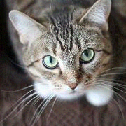
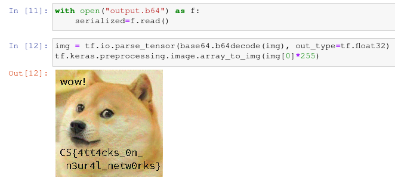

#### Challenge Description:

> Our investigation revealed that CATAPULT SPIDER uses artificial intelligence to classify images. We initially believed that they only encrypt cat pictures - but we now learned that they encrypt all images *except* Doge photographs. We recovered their classifier and model and believe it should be possible to subvert their classification method to protect images against encryption.

> We are providing a TAR file that contains their classification logic, model, and three pictures that must be protected at all cost. We also stood up a service that integrates CATAPULT SPIDER's classification logic at `neurotoxin.challenges.adversary.zone:40755`

> If you're confident that you can protect the images by getting CATAPULT SPIDER to misclassify them, please submit them to our service to receive your reward.

#### Write-Up:

For this challenge we need to beat a given neural network. Specifically generate some [adversarial images](https://en.wikipedia.org/wiki/Adversarial_machine_learning) from given images that look like the original but cause the neural network to misclassify them. I know very little about machine learning and [this post](https://medium.com/@ageitgey/machine-learning-is-fun-part-8-how-to-intentionally-trick-neural-networks-b55da32b7196) was helpful for the basics of this challenge.

Adversarial images are often generated to better train the neural network itself, so I thought there must be some software already out there that makes this easy. Enter: [foolbox](https://github.com/bethgelab/foolbox), "a Python library that lets you easily run adversarial attacks against machine learning models like deep neural networks."

Foolbox has a good tutorial in the form of a [Jupyter notebook](https://github.com/jonasrauber/foolbox-native-tutorial/blob/master/foolbox-native-tutorial.ipynb) so I decided to make my own to play around. [Here](attac.ipynb) is my final notebook. To run this you need to install `jupyter-notebook`, `tensorflow`, and `foolbox`. When installing `foolbox`, it's best to install the latest version from github using `pip`:

```
$ pip install git+https://github.com/bethgelab/foolbox
```

After loading the cat pictures into an acceptable tensor using the given code, we can create a batch tensor to use with our model.

```Python
cats = [load_and_deserialize_picture("pics/cat1"),
        load_and_deserialize_picture("pics/cat2"),
        load_and_deserialize_picture("pics/cat3")]

catz = tf.convert_to_tensor(cats)
```

Then we can load our model and load it into a foolbox model. We also create a `TargetedMisclassification` object to tell foolbox we want our images to be misclassified as doges (category #3).

```Python
model = tf.keras.models.load_model("./tf-model")
fmodel = fb.TensorFlowModel(model, bounds=(0,1))

dogs = tf.convert_to_tensor([3,3,3])
dogez = fb.criteria.TargetedMisclassification(dogs)
```

All that's left to do is actually run the attack.

Foolbox makes it this easy to generate adversarial images. The output tensors are saved in `clipped`:

```Python
attack = fb.attacks.LinfProjectedGradientDescentAttack()
raw, clipped, is_adv = attack(fmodel, catz, dogez, epsilons=.02)
```

Foolbox has a whole toolkit of attacks. The tutorial gives the example of a `L2CarliniWagnerAttack` for a targeted misclassification attack but it didn't end up working for me. I tried every other attack but it either didn't produce a misclassified cat or it wasn't possible to run a targeted attack. Then I searched their github for "TargetedMisclassification" and it turns out their more recent code allows for more attacks to be run as targeted. Using their code from github and running the `LinfProjectedGradientDescentAttack` ended up working.

```
$ python example-evaluation.py out/cat1 --original my-cat-pictures/cat1.png 
[+] both images are close enough
[*] prediction result (classified as Doge):
    class #0 => 0.12% (Cat)
    class #1 => 0.01% (Cow)
    class #2 => 0.00% (Elephant)
    class #3 => 99.82% (Doge)
    class #4 => 0.05% (Squirrel)
[+] picture won't be encrypted \o/
```

For a visual, here is the original image and the adversarial image:

 

Upon submitting the three cat pictures to their service, you recieve the flag in the same format as sent: a base64 serialized tensor. Converting it to an image:



