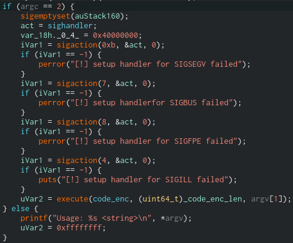

#### Challenge Description:

> Diving deeper into CATAPULT SPIDER's malware, we found that it also supports handing off tasks to external modules. We identified one such module that looks like it might be used to validate a key or password of some sorts, but we're really not sure.

> Can you validate our assumption, and, if possible, extract the key?

#### Write-Up:

This challenge is really interesting, we end up doing frequency analysis on some ciphertext to decrypt a key - but the "plaintext" is in x86_64 assembly language. 

So to start, we're given a relatively simple binary that seems to validate a key. Opening it up in a reverse engineering program (I'm using Cutter here) and decompiling, we find a straightforward main function.



The program takes 1 argument, sets multiple signal handlers, and then runs `execute(code_enc, code_enc_len, argv[1])`, the argument. The signals it looks out for are:

* `SIGSEGV` (Segfault / invalid memory reference)
* `SIGBUS` (Bus error / bad memory acces)
* `SIGFPE` (Floating-point exception)
* `SIGILL` (Illegal instruction)

Which makes sense when we look at what `execute` does. Decompiled here:


Here `execute` uses `mmap` to initialized an anonymous memory map of length `code_enc_len` and copies `code_enc` to it. Then it loops over `code_enc` XORing each byte `code_enc[i]` with byte `key[i % strlen(key)]`. Finally, it actually runs this XORed code with `(*pcVar2)(arg3);`.

This is why `main` set up all those signals - if the input key is wrong, `code_enc` XORed with the key will produce garbled x86_64 instructions. And when we run the bad code it will almost certainly set off a segfault or illegal instruction.

But we can use this to find the key! x86_64 instructions are not random bytes, some bytes show up much more frequently than others. For example the bytes `0x00` and `0xff` are fairly common because they are used to refer to 64 bit numbers or addresses. And the instructions have a structure - `0x48` is commonly followed by `0x89` to make a `mov` or `0x85` to make `test`, both very common instructions.

First let's extract `code_enc`:

```
$ objdump -t module.wow | grep code_enc 
00000000000040a0 g     O .data	00000000000000c4              code_enc
0000000000004164 g     O .data	0000000000000004              code_enc_len
$ objdump -s -j.data module.wow

module.wow:     file format elf64-x86-64

Contents of section .data:
 4080 00000000 00000000 88400000 00000000  .........@......
 4090 00000000 00000000 00000000 00000000  ................
 40a0 161bf286 3afa9c64 78d61c96 7ce73c8b  ....:..dx...|.<.
 40b0 79fa98d8 435f6330 edf49543 537b6327  y...C_c0...CS{c'
 40c0 31f99178 dc8d7ebd 1185f874 8f17a826  1..x..~....t...&
 40d0 d6a478a3 f3414353 7b6c77f2 3588b998  ..x..ACS{lw.5...
 40e0 89b4cb93 862679fa ba78edb3 4378ed4e  .....&y..x..Cx.N
 40f0 95841687 63727970 3cbb1a89 26bd2989  ....cryp<...&.).
 4100 9838f01a cc6f17e0 75943235 c8168b6c  .8...o..u.25...l
 4110 c479f4b4 45b3ea3b c824f236 d93bd6f6  .y..E..;.$.6.;..
 4120 d15e6330 64db7f43 537baab1 2c38fdd5  .^c0d..CS{..,8..
 4130 d61c827c e50c93b8 26b7bb2b b32ba82c  ...|....&..+.+.,
 4140 baba0bd8 3e833af0 b6ff75b7 29f67ce5  ....>.:...u.).|.
 4150 bb3bf6b3 5e306e5f 6c35edf3 f406aff0  .;..^0n_l5......
 4160 268e24b3 c4000000                    &.$.....        
$ objcopy --dump-section .data=module.data module.wow
$ dd if=module.data bs=1 skip=$((0x40a0-0x4080)) count=$((0xc4)) of=code_enc
196+0 records in
196+0 records out
196 bytes copied, 0.00166907 s, 117 kB/s
```

Next we have to figure out the length of the key. We can see some fragments of our flag identifier `CS{` in the encrypted code from null bytes XORing with our key. The first one starts at an offset of 27 bytes. Looks like our flag is 27 bytes long. 

```
$ xxd -c 27 code_enc 
00000000: 161b f286 3afa 9c64 78d6 1c96 7ce7 3c8b 79fa 98d8 435f 6330 edf4 95  ....:..dx...|.<.y...C_c0...
0000001b: 4353 7b63 2731 f991 78dc 8d7e bd11 85f8 748f 17a8 26d6 a478 a3f3 41  CS{c'1..x..~....t...&..x..A
00000036: 4353 7b6c 77f2 3588 b998 89b4 cb93 8626 79fa ba78 edb3 4378 ed4e 95  CS{lw.5........&y..x..Cx.N.
00000051: 8416 8763 7279 703c bb1a 8926 bd29 8998 38f0 1acc 6f17 e075 9432 35  ...cryp<...&.)..8...o..u.25
0000006c: c816 8b6c c479 f4b4 45b3 ea3b c824 f236 d93b d6f6 d15e 6330 64db 7f  ...l.y..E..;.$.6.;...^c0d..
00000087: 4353 7baa b12c 38fd d5d6 1c82 7ce5 0c93 b826 b7bb 2bb3 2ba8 2cba ba  CS{..,8.....|....&..+.+.,..
000000a2: 0bd8 3e83 3af0 b6ff 75b7 29f6 7ce5 bb3b f6b3 5e30 6e5f 6c35 edf3 f4  ..>.:...u.).|..;..^0n_l5...
000000bd: 06af f026 8e24 b3                                                    ...&.$.
```

Now to do some frequency analysis, we need a corpus of x86 instructions to find the most frequent bytes and instructions. For a varied but relatively simple corpus, I used some code and exercises from the *The C Programming Language* by *Brian W. Kernighan and Dennis M. Richie*.

After compiling and dumping the assembly from all of the C programs into `c-prog.all`, I created the following files:

* `c-prog.freq`:  the frequency of each assembly instruction
* `c-prog.bytes`: the frequency of all bytes
* `c-prog.2freq`: the frequency of the first two bytes of each assembly instruction

``` 
$ git clone https://github.com/Heatwave/The-C-Programming-Language-2nd-Edition
$ mkdir bin
$ for i in The-C-Programming-Language-2nd-Edition/*/*.c; do \
      gcc -o bin/$(basename $i .c) $i; \
  done 

... compiler warnings ...

$ for i in bin/*; do objdump -M intel -Dj .text $i >> c-prog.all; done
$ cat c-prog.all | awk -F'\t' '{$1=""; print $0}' \
      		 | sort | uniq -c | sort -n -r > c-prog.freq
$ cat c-prog.all  | awk -F'\t' '{print $2}' \
      		  | tr " " "\n" \
		  | sort | uniq -c | sort -n -r \
		  > c-prog.bytes
$ cat c-prog.all | awk -F'\t' '{$1=""; print $2}'
      		 | awk '{print $1 " " $2}'
		 | sort | uniq -c | sort -n -r > c-prog.2freq
```

Ignoring the whitespace, here is some of the most frequent instructions, bytes, and 2 byte pairs. There's a bit of noise from the compiler, but you get the gist.

```
$ head c-prog.freq 
    863  c3                    ret    
    545  f3 0f 1e fa           endbr64 
    443  0f 1f 80 00 00 00 00  nop    DWORD PTR [rax+0x0]
    430  55                    push   rbp
    359  b8 00 00 00 00        mov    eax,0x0
    321  48 89 e5              mov    rbp,rsp
    284  5d                    pop    rbp
    223  00 00 00 00 
    222  48 85 c0              test   rax,rax
$ head c-prog.bytes 
  13744 00
   6185 48
   3812 ff
   2694 89
   2172 0f
   1856 8b
   1843 45
$ head c-prog.2freq 
   1395 48 8d
   1169 48 89
    931 48 8b
    863 c3 
    709 48 83
    604 0f 1f
    582 f3 0f
    532 8b 45
    530 00 00
```

Then I XORed the encrypted code with the most popular few bytes, `0x48`, `0xff`, and `0x89` and then lined it all up with the original encrypted code and got to cracking. [Here](module-wow-notes.txt) are my notes after decrypting the flag.

I won't be able to reconstruct every logical leap I took but here are some final thoughts on the decryption process:

* Using the structure of previous flags was really helpful. Not just the fact that they started with `CS{` and ending with `}`, but the frequent use of l33t speak, the underscore in between words, and the fact it was an English phrase was really helpful. Seeing `CS{` followed by `cryp` in the original `code_enc` and I wanted the first word to be `crypto`, `cryptic` or some variant.  A history of playing word puzzles and games also helped with this. 
* Taking the time to write a few helper functions in python was enormously helpful. One to XOR any bytestring with any other, one to XOR the first few lines of the encrypted code with an assumed flag, one to print it out all nice. I did it all in the interactive shell, so these snippets are lost to time but doing the challenge without it would have been very very tedious.
* The main workflow was guessing which letter 'felt' best for the next letter based on english rules and the XORed common bytes. There's not much signal in the noise so after a bit I would hit a wall. Then I XORed what I had the flag that I had so far, say `CS{crypt0_`, with the encrypted code to see what would make sense for each line of assembly instructions. Grepping the frequency lists for bytes "on the edge" of the known code helped break the deadlock. 
* I would be remiss if I didn't mentioned that I lost the most amount of time to this challenge due to a stupid mistake. When first copying `code_enc` from the binary, I misread/mistyped and thought it was only `0x4c` bytes instead of `0xc4`. Needless to say, doing frequency analysis on a short piece of encrypted data was very hard. Though I did do some of the most interesting reading while stuck, particularly this [blog post from FireEye]( https://www.fireeye.com/blog/threat-research/2017/12/recognizing-and-avoiding-disassembled-junk.html). I had to come back on a later day and retrace my steps in order to realize my mistake.
