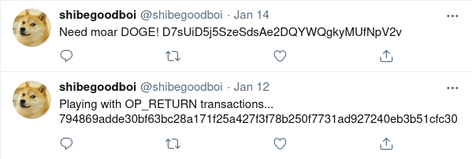
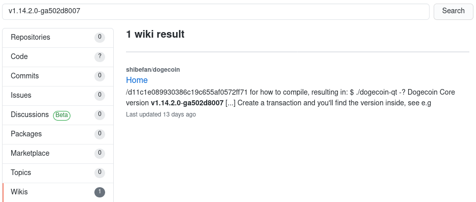

#### Challenge Description:

> We have received some information that CATAPULT SPIDER has encrypted a client's cat pictures and successfully extorted them for a ransom of 1337 Dogecoin. The client has provided the ransom note, is there any way for you to gather more information about the adversary's online presence?

#### Write-Up:

For this challenge, we're given a ransom note from a client and asked to track down the adversary's online presence. Apparently Catapult Spider encrypted a client's cat pictures and extorted them for 1337 dogecoin.

The ransom note has a beautiful image of an ASCII art doge and the message

>                            MUCH SAD?
>                      1337 DOGE = 1337 DOGE
>                DKaHBkfEJKef6r3L1SmouZZcxgkDPPgAoE
>              SUCH EMAIL shibegoodboi@protonmail.com

The hash is a dogecoin address and the email contains some clues to other places the adversary hangs out.

Searching the email username `shibegoodboi`:

And we find their [twitter](https://twitter.com/shibegoodboi) and [reddit](https://www.reddit.com/user/shibegoodboi/) accounts. Both account points to a different dogecoin address `D7sUiD5j5SzeSdsAe2DQYWQgkyMUfNpV2v` and the twitter account mentions it is playing with OP_RETURN transactions

I browsed the dogecoin blockchain for a bit, trying to "follow the money" and search google for downstream addresses with no success. One particular [transaction](https://dogechain.info/tx/794869adde30bf63bc28a171f25a427f3f78b250f7731ad927240eb3b51cfc30) stood out because one of the outputs was to "nulldata". It looks like the same transaction hash that `shibegoodboi` tweeted about using OP_RETURN transactions with...

It look like [OP_RETURN transactions](https://en.bitcoin.it/wiki/OP_RETURN) on the dogecoin blockchain (and others) are ways to mark transaction outputs as invalid with a strange side effect of being able to store arbitrary data in the blockchain. If we [look up](https://opreturn.net/794869adde30bf63bc28a171f25a427f3f78b250f7731ad927240eb3b51cfc30) the data in that OP_RETURN transaction, we find it contains the string `v1.14.2.0-ga502d8007`. Hmmm.. looks like a version number - let's search github for it:

Aha! We found our adversary's [github page](https://github.com/shibefan)! Looks like they forked Dogecoin, Dogescript (meme javascript), and DSON (meme json) as well as having their own personal site and encryption (doge)script there. Clicking around their personal site and Wow. So OSINT. Much flag. 

