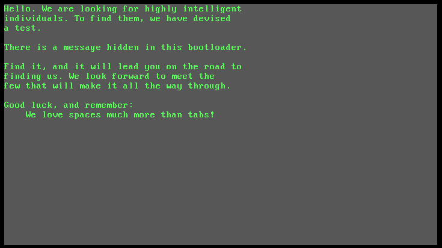
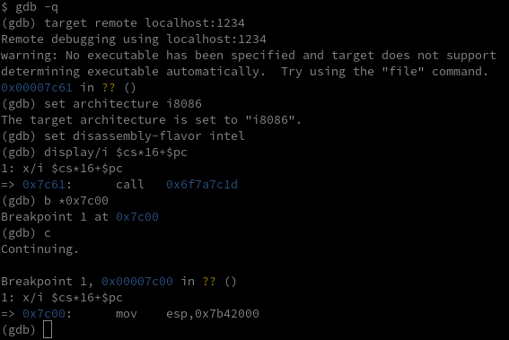

#### Challenge Description:

> A mysterious file appeared on a deep dark web forum. Can you figure out what we can't see right now?

#### Write-Up:

We are given a strange 512 byte file `proclaimation.dat` that `file` sees as a boot partition. 

```
$ wc proclamation.dat
  1   8 512 proclamation.dat
$ xxd proclamation.dat | head
00000000: bc00 20b4 0730 c031 c9b7 8ab6 61b2 61cd  .. ..0.1....a.a.
00000010: 10b4 0231 d230 ffcd 10eb 465e 83c6 14b2  ...1.0....F^....
00000020: 0966 52b3 00b4 0e8a 0483 c601 665a 66c1  .fR.........fZf.
00000030: e202 6683 c242 6681 e2ff 0000 0066 31d0  ..f..Bf......f1.
00000040: 6652 0c00 7419 88c2 80f2 0a74 04cd 10eb  fR..t......t....
00000050: d2b4 03cd 10b4 02fe c6b2 00cd 10eb c4fa  ................
00000060: f4e8 b7ff 796f 7527 7265 206f 6e20 6120  ....you're on a 
00000070: 676f 6f64 2077 6179 2ebf c686 85c4 cabd  good way........
00000080: 8fca 8b98 8fca 8685 8581 8384 8dca 8c85  ................
00000090: 98ca 8283 8d82 8693 ca83 849e 8f86 8683  ................
$ file proclamation.dat 
proclamation.dat: DOS/MBR boot sector
```

I did not trust `file` for way too long, because initially I did not know what to do with a boot partition. After looking at the file every which way, I finally tried to treat the file as a disk image and boot to it

```
$ qemu-system-i386 -drive format=raw,file=proclamation.dat
```



Aha! Now we know what the file is, we need to examine the bootloader and how it works in order to get our flag. Thankfully qemu has a built in gdb debugger that allows you to step through the execution of the bootloader and examine memory to see how it works. [These instructions](https://weinholt.se/articles/debugging-boot-sectors/)  were helpful in getting set up.

```
$ qemu-system-i386 -s -fda proclamation.dat -boot a
```



The bootloader uses `8086` architecture, the precursor to intel's `x86` architecture. It is only 16-bit but uses two registers, a __segment__ and an __offset__ to have access to a 20-bit address space. So in order to find the address of the current 8086 instruction, we multiply the segment containing code `$cs` by 16 and add the offset, `$pc` the program counter (aka `%eip`).

This turns out to be a huge pain to deal with in regular gdb. Trying to examine the stack becomes very difficult and gdb's examine instruction `x/i` sometimes doesn't return the correct `8086` instruction. Thankfully, [someone wrote an amazing gdb script](https://ternet.fr/gdb_real_mode.html) to help debug `8086` code. 

Using this mode, let's debug the bootloader to find out how it prints its message even though the message isn't in `proclamation.dat`'s plaintext. The bootloader code is loaded at `0x7c00` so if we disassemble the instructions, we can see a bit of what it does.


It's hard to see exactly what's going on, but note the many `int 0x10` instructions, a [bios system call](https://en.wikipedia.org/wiki/INT_10H) to handle video output. Setting `b`reakpoints at all of them and `c`ontinuing until the text starts to output, we find that `0x7c4d` is the call that actually outputs a character of the proclamation to screen. After outputting the character, it `jmp`s back to `0x7c23`. 

So let's take a closer look at this loop between `0x7c23` until `0x7c4f`. The gdb "real mode" script helps immensely with understanding what the registers and stack looks like in `8086`. Before printing the ascii character `W` to the screen, here is what the bootloader looks like at the start of the loop at `0x7x23`:  


And here is what is looks like at the end of the loop, before running the system call to update the screen. Note that `AX` is set to `0x0E57` which tells the [video system call](https://en.wikipedia.org/wiki/INT_10H) to teletype output (`0x0E`) the ASCII character `W` (`0x57`)


Let's take a closer look at the code in this loop. Some of the gdb disassembly doesn't get all of the 8086 instructions right, so to be sure, we should dump instruction memory and use a dedicated disassembler like `ndisasm`. 

```
(gdb) dump binary memory loop-code.bin 0x7c23 0x7c51
(gdb) quit
$ ndisasm -o $((0x7c23)) loop-code.bin | head -5
00007C23  B300              mov bl,0x0
00007C25  B40E              mov ah,0xe
00007C27  8A04              mov al,[si]
00007C29  83C601            add si,byte +0x1
00007C2C  665A              pop edx
```

Here is how I understand the loop code:

```NASM
mov bl,0x0		   ; set the offset (BX) to 0
mov ah,0xe     	   ; set the higher byte of AX to e
    	    	   ; used to tell our system call to teletype output
mov al,[si]  	   ; get the next character from the "source index"
    		   	   ; often used to store strings and then 
add si,byte +0x1   ; increment the string pointer
pop edx	     	   ; grab the top of the stack and store it in DX
shl edx,byte 0x2   ; do some weird bitwise math with DX
add edx,byte +0x42 ; this math starts off changing every char output, 
and edx,0xff 	   ; but stablizes to have 0xEA input and 0xEA output 
xor eax,edx	   	   ; xor the char from the input string with 0xEA
push edx		   ; save 0xEA back on the stack
or al,0x0		   ; check if the character is the null byte
jz 0x7c5f		   ; if so, jump to the end
mov dl,al		   ; check if the character
xor dl,0xa		   ; is 0x0a, the newline character
jz 0x7c51		   ; if so jump to code to go to the next line
int 0x10		   ; execute our system call to print the xored char
jmp short 0x7c23	   ; start over
```

We could XOR the initial file with `0xEA` to find our flag but for extra swag points lets change the null byte that ends the proclamation with a space so the bootloader keeps printing. The null byte will be `0xEA` in the original proclamation and a space character `0x20` XORed with `0xEA` makes `0xCA`. So:

```
$ xxd proclamation.dat > proclamation.hex
$ grep ea proclamation.hex 
000001c0: 828b 84ca 9e8b 8899 cbea 8119 11a9 b991  ................
000001e0: da9e 86da 8b8e d998 9797 eaf4 f4f4 f4f4  ................
$ sed 's/cbea/cbca/g' proclamation.hex | xxd -r > new-proclamation.dat
$ qemu-system-i386 -drive format=raw,file=new-proclamation.dat
```


What would have made this challenge even harder is to make the bitwise math more interesting. The progression of `DX` is `0x09`-> `0x66` -> `0xDA` -> `0xAA` -> `0xEA` -> `0xEA` -> `0xEA` etc is somewhat uninteresting, practically we only need to XOR the file with `0xEA`. I checked the algorithm in the challenge (shift left 2 and add 42) and all intial values (`0x00` to `0xFF`) produce `0xEA` after a few iterations, so it seems to be a problem with the algorithm. You could say the sequence "degenerates" into just a single byte rather than making an interesting cycle.

Though it does raise an interesting math question: which bitwise algorithms, when repeatedly done on just one byte, "degenerate" and which ones produce more interesting results? Which operations (+, -, *, /, <<, >>, ^, &) help and hurt? What length cycles can you produce? The few simple add and left shift algorithms I tried all seem to "degenerate". But using right shifts I found some cycles of 2 and 4.

P.S: From [Crowdstrike's writeup of this challenge](https://www.crowdstrike.com/blog/adversary-quest-walkthrough-four-space-jackal-hacktivist-challenges/), they recognize the "degrated" nature of this "algorithm". They also name this type of algorithm: its a [Linear Congruential Generator](https://en.wikipedia.org/wiki/Linear_congruential_generator).