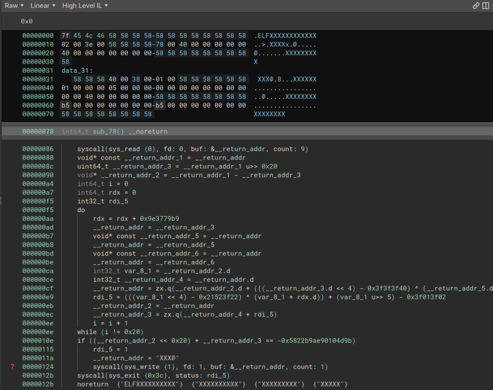

## The Challenge 

> A Tiny one to start, based on the works of TheXCellerator in Tmp.0ut [(link)](https://cracktheelf.github.io/challenges)

We're given a tiny x86_64 ELF binary (only 301 bytes!), which uses [TheXCellerator's libgolf](https://tmpout.sh/1/1.html) to mangle the ELF header. 
The binary is runnable on 64-bit Linux, but breaks many static analysis tools that trust the ELF header. 

```
TinyTurb0 > readelf -a ./tiny_turb0
ELF Header:
  Magic:   7f 45 4c 46 58 58 58 58 58 58 58 58 58 58 58 58
  Class:                             <unknown: 58>
  Data:                              <unknown: 58>
  Version:                           88 <unknown>
  OS/ABI:                            <unknown: 58>
  ABI Version:                       88
  Type:                              EXEC (Executable file)
  Machine:                           Advanced Micro Devices X86-64
  Version:                           0x58585858
```

BinaryNinja also has trouble, but by using "Make Function at This Address" at byte 0x78 (the end of the ELF header and Program header), we can read the IL. 



The shellcode is quite simple. It reads 8 bytes from stdin, does various operations to these bytes in a 32 iteration loop, then compares the output to a fixed value (`0xa7dd46516fefb265`). 
If equal, it prints "1", otherwise nothing. The obvious goal is to find the correct input to satisfy this condition.

The hard part is the "various operations" in the loop. The length and complexity of the operations in the loop are simple enough to understand going forward, but a cursory attempt to reverse the instructions proved impossible.

## The Solution

To solve, we used [pySMT](https://github.com/pysmt/pysmt), an API in python that can encode an Satisfiable Modulo Theory (SMT) problem in a single format and use multiple underlying solvers on it such as z3 or MathSAT.

The form of our pySMT solution is to symbolize the initial input, encode the operations done on that symbol, set it equal to the fixed value, and finally run it through a solver to find the initial value.

Thankfully pySMT inclues a BitVector (`BV`) class where 32 or 64 bit registers can be symbolized, encoded, and operated on using the equivalent x86_64 instructions. 
For example, the x86 instruction to shift bits to the right, `shr`, can be translated into `BVLShr`. 
Encoding the registers as an Integer class in pySMT would not be sufficient as operations that cause overflows or 32-64 bit translations would not work. 

Instead of going through manually translating the instructions into pySMT code, we wrote a code generator using the BinaryNinja python API.
The [Low Level Instruction Language](https://docs.binary.ninja/dev/bnil-llil.html#low-level-il-instructions) with it's tree-like instructions paired well with modern python to make nice recursive function to generate the pySMT code: 

```python
def generate_smt(llil: LowLevelILInstruction) -> str:
    if hasattr(llil, "operands"):
        ops = llil.operands
    match type(llil):
        case lowlevelil.LowLevelILReg \
             | lowlevelil.ILRegister:
            return str(llil)
        case lowlevelil.LowLevelILZx:
            return f"BV(value={llil.src.constant}, width={llil.size * 8})"
        case lowlevelil.LowLevelILXor:
            return f"BVXor({generate_smt(ops[0])}, {generate_smt(ops[1])})"
        case lowlevelil.LowLevelILLsr:
            return f"BVLShr({generate_smt(ops[0])}, {generate_smt(ops[1])})"
        case lowlevelil.LowLevelILLsl:
            return f"BVLShl({generate_smt(ops[0])}, {generate_smt(ops[1])})"
        case lowlevelil.LowLevelILAdd:
            return f"BVAdd({generate_smt(ops[0])}, {generate_smt(ops[1])})"
        case lowlevelil.LowLevelILSub:
            return f"BVSub({generate_smt(ops[0])}, {generate_smt(ops[1])})"
        case lowlevelil.LowLevelILConst:
            if llil.constant < 0:
                return f"BV(value={llil.constant + (2 ** (llil.size * 8))}, width={llil.size * 8})"
            else:
                return f"BV(value={llil.constant}, width={llil.size * 8})"
        case lowlevelil.LowLevelILPop:
            return f"stack.pop()"
        case lowlevelil.LowLevelILPush:
            return f"stack.append({generate_smt(ops[0])})"
        case lowlevelil.LowLevelILSetReg:
            return f"{generate_smt(ops[0])} = {generate_smt(ops[1])}"
        case other:
            return f"# {other.__name__} : Unsupported instruction"
```

Generates code that looks like this: 

```python
# rbx = rax
rbx = rax

# rbx = rbx u>> 0x20
rbx = BVLShr(rbx, BV(value=32, width=64))

# rax = rax - rbx
rax = BVSub(rax, rbx)
```

We also want to automatically translate between 32 and 64 bit register values, which we can do with pySMT's useful `BVExtract` and `BVConcat` functions:

```python
# eax = eax + edx
edx = BVExtract(rdx, start=0, end=31)
eax = BVExtract(rax, start=0, end=31)
eax = BVAdd(eax, edx)
rax_upper = BVExtract(rax, start=32)
rax = BVConcat(rax_upper, eax)
```

After generating the code from LLIL, we prepend the generated code with the correct Symbols and initial states: 

```python
from pysmt.shortcuts import *
from pysmt.typing import BVType

stack = []

# Define registers as Symbols to solve for or with fixed initial values
rax = Symbol("rax", BVType(width=64))
rdx = BV(value=0, width=64)
r10 = BV(value=0, width=64)
```

add the 32 iteration loop manually (If and Goto instructions are not supported in code gen), and append the code to actually solve for the expected value ([full code](./gen.py.txt)):

```python
# r10 = rax
r10 = rax

# r10 = r10 << 0x20
r10 = BVLShl(r10, BV(value=32, width=64))

# r10 = r10 + rbx
r10 = BVAdd(r10, rbx)

# Specify what the register output *should* be
formula = Equals(r10, BV(value=0xa7dd46516fefb265, width=64))

# Then solve!
model = get_model(formula)
print(model)
```

We can finally run the (slightly edited) [generated code](./solve.py.txt) to solve for the correct value. This took about 4.5 hours on my machine: 

```bash
$ python solve_tiny.py
rax := 3157359846414823104_64
python solve_tiny.py  15578.03s user 0.75s system 80% cpu 5:23:17.90 total

$ python -q
>>> (3157359846414823104).to_bytes(8, "little")
b'\xc0.\xa3I\r2\xd1+'

$ printf '\xc0.\xa3I\r2\xd1+' | ./tiny_turb0
1
```
